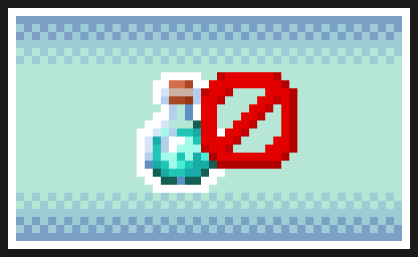

# Effect Visibility 0.3.0 / 状态效果隐藏：六版本 NeoForge 移植包



**作者：幼幼紫 · 英文名：Effect Visibility · 注册名：`effect_visibility`**

[下载各版本模组与完整源码](https://github.com/uuzsx/effect-visibility/releases/tag/v0.3.0)

六个独立客户端模组，保留 0.2.1 的功能：隐藏全部效果、搜索并切换单个效果、重置隐藏，HUD 和物品栏统一隐藏，实际状态效果继续生效。设置列表会排除 Xaero 小地图/世界地图命名空间下 `no_` 开头的限制状态，其他模组效果仍可选择。

## 下载版本对应关系

| Minecraft Java | NeoForge 最低版本 | Java | JAR |
|---|---|---|---|
| 1.21.1 | 21.1.1 | 21 | effect-visibility-0.3.0-mc1.21.1-neoforge.jar |
| 1.21.2 | 21.2.0-beta | 21 | effect-visibility-0.3.0-mc1.21.2-neoforge.jar |
| 26.1.1 | 26.1.1.0-beta | 25 | effect-visibility-0.3.0-mc26.1.1-neoforge.jar |
| 26.1.2 | 26.1.2.71 | 25 | effect-visibility-0.3.0-mc26.1.2-neoforge.jar |
| 26.2 | 26.2.0.57 | 25 | effect-visibility-0.3.0-mc26.2-neoforge.jar |
| 26.3 | 26.3.0.0-beta | 25 | effect-visibility-0.3.0-mc26.3-neoforge.jar |

各包锁定对应 Minecraft 版本，使用较早 NeoForge 作为最低依赖。1.21.2、26.1.1 和 26.3 的官方 NeoForge 发布序列为 beta。本次编译和客户端检查均使用表中最低版本；更高 NeoForge 构建没有逐一测试。

## 安装与操作

1. 从总包中只取与你的 Minecraft 版本对应的一个 JAR，放入客户端实例的 `mods` 文件夹。移除旧版 Effect Visibility，避免同时安装多个版本。
2. 在“模组 → Effect Visibility → 配置”中打开设置。
3. 开启“隐藏全部效果”可隐藏所有状态提示；关闭后按单个效果的选择隐藏。
4. 搜索名称或 ID，点击效果行切换“隐藏/显示”。鼠标悬停可查看完整 ID。
5. 点击“重置隐藏”可关闭隐藏全部并清空单个选择。
6. 点击“保存并返回”使修改生效。取消或 Esc 放弃草稿。

开启隐藏全部时，单个按钮暂时不可操作；关闭后恢复，已选项会保留。可在按键绑定中给“打开效果隐藏设置”分配按键，默认未绑定。

服务端无需安装。模组不改变效果等级、持续时间、属性加成、粒子和夜视等画面效果。使用自有显示系统的模组需要单独适配。

配置文件仍是 `config/effect_visibility-client.toml`，保留两个设置：

```toml
hideAll = false
hiddenEffects = ["minecraft:night_vision", "minecraft:speed"]
```

默认不隐藏任何效果。已有隐藏 ID 会保留；旧配置中已经选择的 Xaero 限制状态也保留，但不会显示在列表里，可用重置隐藏清除。效果 ID 在不同游戏版本或模组版本之间可能改变，迁移配置后可重新核对选择。

## 验证范围

每个版本均完成编译、11 项自动规则测试、最低 NeoForge 下的客户端启动检查、两个 GUI Mixin 的实际注入、中文设置界面截图检查。

客户端自动检查覆盖：注册测试模组效果、搜索名称/ID、隐藏单个和全部、关闭隐藏全部后保留单个选择、重置、保存/取消、缩放保留草稿，并确认效果对象、等级和时长没有改变。

Xaero 列表排除规则在六个版本中均通过测试。此前 0.2.1 已在 MC 26.1.2 同时安装 Xaero Minimap 26.5.0 / World Map 1.46.0，检查实际 12 个限制状态的排除；本轮六版本客户端使用测试模组验证一般模组效果，没有逐版本安装实际 Xaero，也没有测试世界内地图操作或联机。

总包附每个版本的设置界面截图、校验值和 `verification.json`，列明验证结果与范围。

## 源码构建

源码包含 `versions/<Minecraft版本>` 下的六个完整独立 Gradle 工程。各工程分别适配自己的 GUI、资源 ID、输入接口和 HUD/物品栏显示入口。共用的隐藏策略、Xaero 列表排除策略和语言内容保持一致。

进入对应版本目录，运行 `gradlew.bat build`；开发启动使用 `gradlew.bat runClient`。构建输出为 `build/libs/effect-visibility-mc<版本>-neoforge-0.3.0.jar`。

使用 JDK 25 运行 Gradle，1.21.x 工程会使用 Java 21 工具链，其余版本使用 Java 25。工程可通过 Foojay 获取所需工具链，也可提前安装 JDK 21 与 25。

Windows 下可在源码根目录执行 `build-all.ps1` 顺序构建全部版本。

自动客户端检查：在版本目录运行 `gradlew.bat -PsmokeTest runSmokeClient`。需要桌面图形环境；为了截图检查可在 `run-smoke/options.txt` 中设置 `lang:zh_cn`、`guiScale:2`。测试启动使用独立的 `run-smoke` 文件夹，不会修改你的游戏实例。测试模组代码不进入发布 JAR。

MIT 许可，工程沿用 [NeoForge 官方 MDK](https://github.com/NeoForgeMDKs) 的模板许可。NeoForge 发布版本来源：[官方 Maven 版本列表](https://maven.neoforged.net/releases/net/neoforged/neoforge/maven-metadata.xml)。
